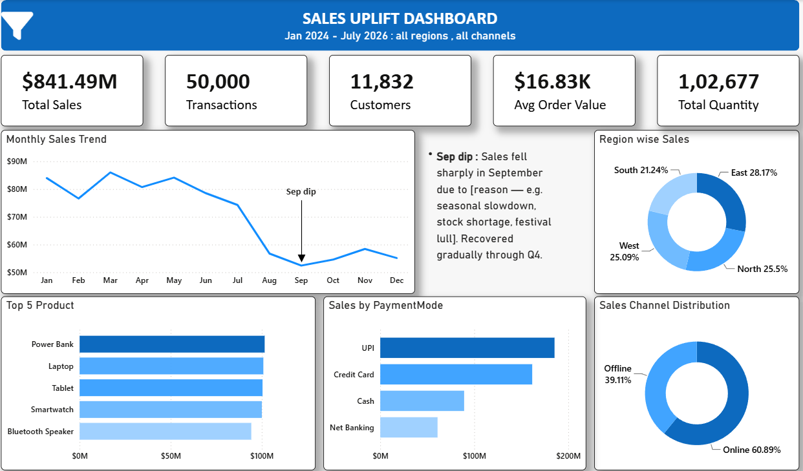

# 🛒 Retail Sales Uplift Dashboard

An end-to-end data analytics project analyzing **50,000 retail transactions** across four regions to uncover sales trends, regional performance, and product/channel behavior, using **MySQL** for structured querying and **Power BI** for interactive visualization.

---

## 📌 Project Overview

This project analyzes multi-region retail transaction data spanning January 2024 to July 2026 to answer key business questions around regional sales performance, top-selling products, category trends, and channel/payment behavior — helping translate raw transactional data into actionable business insights.

## Dashboard Screenshot


**Workflow:**
```
CSV Data → MySQL (SQL Analysis) → Power BI (Dashboard) → Insights & Recommendations
```

---

## 🗂️ Dataset

- **Rows:** 50,000 transactions
- **Date range:** 2024-01-01 to 2026-07-27
- **Columns:** 11 features

**Key features:**
| Category | Fields |
|---|---|
| Transaction Info | TransactionID, Date, CustomerID |
| Product Info | ProductName, Category, Quantity, UnitPrice, TotalAmount |
| Sales Context | Region, SalesChannel, PaymentMode |

---

## 🗄️ SQL Analysis

`RetailAnalysis.sql` contains 7 business-question queries, including:

1. Total sales amount per region for the last quarter
2. Top 5 best-selling products by revenue
3. Monthly sales trend across all regions
4. Region-wise contribution to total sales (%)
5. Online vs. offline sales comparison across all months
6. Category-level trend detection (Rising / Falling / No Change) using window functions
7. Customers who purchased more than 10 times (loyalty/frequency segment)

---

## 📊 Power BI Dashboard

`Sales_Uplift_Dashboard.pbix` — an interactive dashboard with filters for **Month, Region, Sales Channel, and Payment Mode**, featuring:

- KPI cards: $841.49M total sales, 50,000 transactions, 11,832 customers, $16.83K avg. order value
- Monthly sales trend line chart
- Regional sales breakdown (donut chart)
- Top products by sales (bar chart)
- Sales by payment mode
- Online vs. offline channel split


---

## 🔑 Key Insights

- **Channel split:** Online sales account for **60.89%** of total revenue ($512.35M) vs. **39.11%** offline ($329.14M).
- **Regional performance:** East leads with **28.17%** of total sales ($237.07M), followed by North (25.50%), West (25.09%), and South (21.24%) — a relatively balanced spread across regions.
- **Category concentration:** Electronics dominates category revenue at **$683.99M**, far ahead of Home & Kitchen ($56.01M) and Clothing ($43.90M) combined.
- **Top products:** Power Bank ($101.61M), Laptop ($100.88M), Tablet ($100.45M), Smartwatch ($100.06M), and Bluetooth Speaker ($94.26M) are the top 5 revenue-generating products, all clustered closely together.
- **Payment behavior:** UPI is the leading payment mode ($314.72M), followed by Credit Card ($271.44M), Cash ($154.33M), and Net Banking ($101.00M).
- **Customer loyalty:** Only 52 of 11,832 customers made more than 10 purchases, with a maximum of 16 purchases by a single customer — indicating a largely transactional, low-repeat customer base.
- **Sales stability:** Monthly sales remain consistent throughout the 2.5-year period (~$24M–$30M per month), with no significant seasonal collapse in any single month.

---

## 💡 Business Recommendations

- **Double Down on Electronics** – Given its outsized share of revenue, prioritize inventory planning and marketing spend on this category.
- **Grow Repeat Purchases** – With very few customers exceeding 10 purchases, introduce loyalty incentives to convert one-time buyers into repeat customers.
- **Strengthen Digital Payments** – UPI's lead suggests continued investment in digital payment UX and incentives could further reduce cash dependency.
- **Balance Regional Investment** – Since South lags other regions by several points, investigate localized demand drivers or marketing gaps.
- **Channel Strategy** – With online sales nearly 1.6x offline, ensure offline/in-store experience is not being neglected in favor of digital growth.

---

## 🛠️ Tech Stack

| Tool | Purpose |
|---|---|
| MySQL | Database storage & SQL querying |
| Power BI | Interactive dashboard & visualization |
| DAX | Custom measures & time intelligence |

---

## 📁 Repository Structure

```
├── RetailTransactions.csv          # Raw transaction dataset
├── RetailAnalysis.sql              # SQL business-question queries
├── Sales_Uplift_Dashboard.pbix     # Power BI dashboard
├── screenshots/                    # Dashboard screenshots
└── README.md
```

---

## 🚀 How to Reproduce

1. Clone the repository and create a MySQL database using `RetailAnalysis.sql`.
2. Load `RetailTransactions.csv` into the `retail_transactions` table (via `LOAD DATA INFILE` or a MySQL import tool).
3. Run the queries in `RetailAnalysis.sql` to reproduce the SQL-based analysis.
4. Open `Sales_Uplift_Dashboard.pbix` in Power BI Desktop and refresh the data source to explore the dashboard.

---

## 📄 License

This project is open-sourced for learning and portfolio purposes. Feel free to fork and build upon it.
